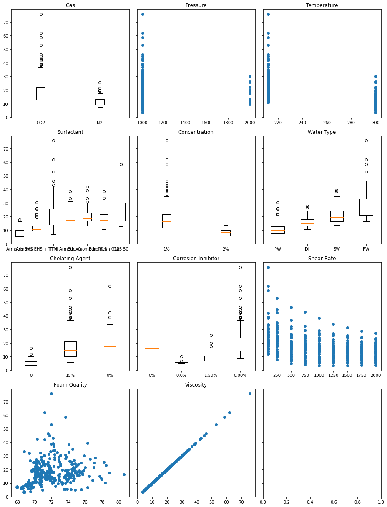
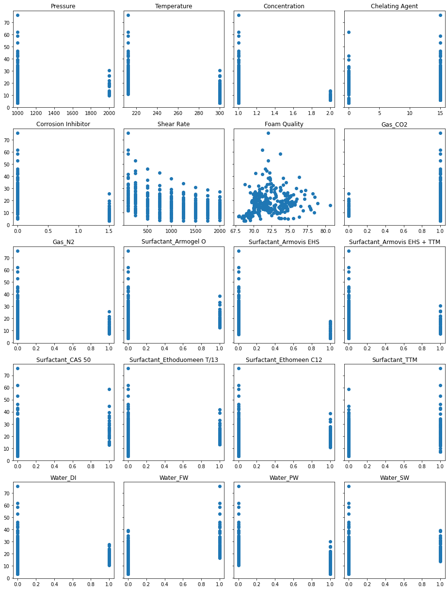
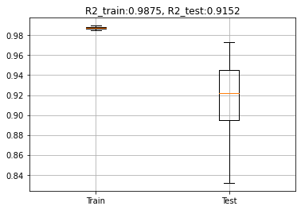
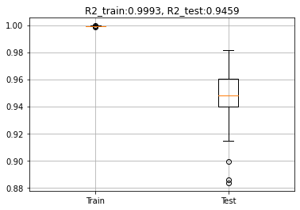
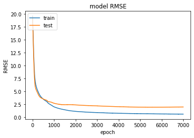
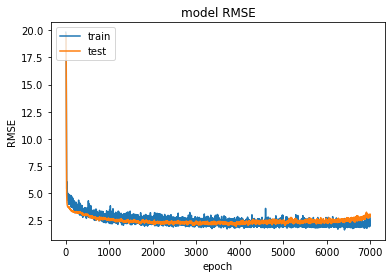

## Summary
Predicting the viscosity of oil is important for many applications. This project was designed to show that using ML techniques it is possible to achieve good levels of accuracy in predicting viscosity given a set of conditions. Gradient Boosting was the most promising model, but a simple NN with 1 hidden layer also performed well.

## Purpose
Oil viscosity is a measure of an oil's resistance to flow. It governs the sealing effect of oils, the rate of oil consumptions, the ease at which machines can be started, and the ease at which oil can be transported. Oil viscosity is dependent on a number of factors, such as temperature and pressure. The purpose of this study is to see if machine learning techniques can be used to predict the viscosity of oil under a certain set of conditions.

## Feature Analysis
There are 10 features collected from laboratory experiments, and 361 observations. The experimental dataset comprised of different surfactants, their concentrations, corrosion inhibitors, different gases, different water types, pressure, temperature, temperate, sheer rate and foam quality. Seven surfactants were tested (Armovis EHS, Armovis EHS + TTM, TTM, Armogel, Ethoduomeen, T/13, Ethomeen C12, and CAS 50). Two different gases were tested (Carbon dioxide, nitrogen). Four different types of water (Producted water, Formation water, deionized water, and seawater). The 10 features vs. viscosity are shown below (unpreprocessed).

## Preprocessing
The experimental data was clean as it was collected under laboratory conditions. Categorical features were one-hot encoded. Numerical features were converted to float. Slight kurtosis was observed in some feature distributions, but nothing that needed addressing. The final 20 features are shown below. The data was standardized before being used to train models. The dataset was split 80% train and 20% test.

## Random Forrest / Gradient Boosting
GridSearch was used on the training data to identify hyperparameters for the random forrest (maximum features per tree, and maximum depth per tree). The final model had 1000 trees, with maximum features of 6 per tree. This model was trained 50 times on shuffled versions of the dataset (given the small size of the dataset), and the results shown below. The coefficient of determination on test data ranged from 0.90-0.94, with the average of 0.92.

GridSearch was used on the training data to identify hyperparameters for gradientboosting (maximum features per tree, and maximum depth per tree). The final model had 1000 trees, with maximum features of 4 per tree and maximum depth of 3. This model was trained 50 times on shuffled versions of the dataset (given the small size of the dataset), and the results shown below. The coefficient of determination on test data range from 0.94-0.96 with 0.95 the average. I would note gradient boosting achieved better results and more consistent results than the Random Forrest.

## ANN 1 & 2 Hidden Layers
Two densely connected neural networks were also trained on the data. The first neural network had 1 hidden layer with 25 units (with sigmoid activation). The second neural network has 2 hidden layers with 25 and 12 units, and used batch normalization (with regualarization parameter of 0.1) to control overfitting. Both were trained on 7000 epochs. Given the size of the data set batching was not performed. Root mean squared error was used for the loss function in both cases.

First neural network (1 hidden layer): The coefficient of determination on test data was 0.94. Training was stable.

Second neural network (2 hidden layers): The coefficient of determination on test data was 0.87. Training was more volatile, and the performance on the validation data began to deteriorate towards the end (further work could involve using early stopping to prevent overfitting).

